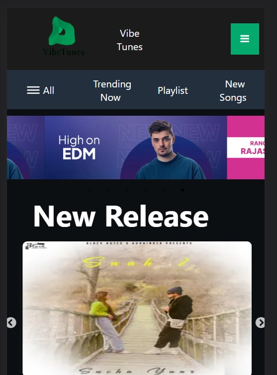

<h1>VibeTunes</h1>

This is a music website called vibeTunes to create and listen to music.

<h3>Live Link: https://frontend-nainapremani.vercel.app/</h3> 

<h3>About the Project:</h3>
This is a music website which is made by a group of 4 members in a span of 5 days. The motive of making this was to practice and test our skills that we acquired as of now in Masai School. 

## Features ✨

- User authentication, admin authentication.
- Home Page.
- Playlist
- Listen to songs 
## Contributors  😇

- 👤 [Tejesh Kumar Reddy]
- 👤 [Naina Premani]
- 👤 [Ravindra]
- 👤 [Ravi Shukla]

           
<h3>Screenshots:</h3>
<h1>Laptop Screen</h1>
 
<h1>Mobile Screen</h1>
 

<h3>Technologies Used:</h3>
<ul>
        <li>React</li>
        <li>Chakra UI</li>
        <li>React-Redux</li>
        <li>Reqres</li>
        <li>CSS</li>
  <li>
    Node
  </li>
  <li>Express</li>
  <li>Mongodb Atlas</li>
<h3>Getting Started</h3>
To get started with the project, you can either clone this repository to your local machine:

Or you can fork the repository to your own GitHub account and clone your forked repository.

Once you have the code on your machine, open the project folder in your code editor and start coding.

<h3>Project Structure</h3>

    >my-app
    ├── >src
    │    └── Components
    │    └── images
    │    └── Pages
    │    └── Redux
    │    └── Styling
